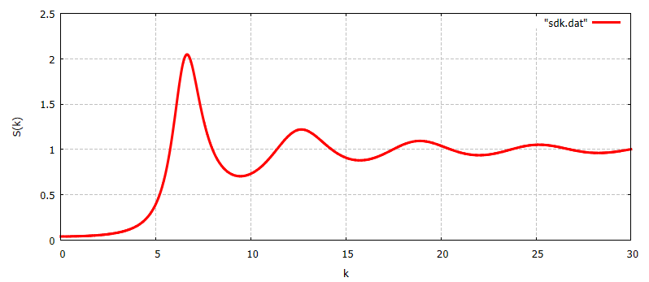

# 4taEIIMFE

Repositorio para los talleres de teoría de líquidos y la [Self-Consistent Generalized langevin Equation(SCGLE)](https://doi.org/10.1103/PhysRevE.62.3395) de la [4ta EIIMFE](https://sites.google.com/view/lanimfe/eventos/iv-escuela-internacional).

Este repositorio está escrito principalmente en [Julia](https://julialang.org) y contiene algunos documentos `.plt` que se pueden ejecutar usando [gnuplot](http://www.gnuplot.info/).

## Ejecución simplificada

La ejecución de los códigos es sumamente sencilla y pretende ser una herramienta introductoria para la SCGLE. Un ejemplo de esto lo encontramos en el cálculo de la estructura de un sistema de esferas duras.

```julia
# Grid en el vector de onda
kₘᵢₙ = 0.0
kₘₐₓ = 15*π
N = 1000
# Parámetros físicos
phi = 0.4
I = Input_HS(kₘᵢₙ, kₘₐₓ, N, ϕ, VW = true)
# Factor de estructura estático
k = vector_de_onda(I)
S = estructura(I)
# Salvando datos
save_data("sdk.dat", [k S])
```

y podemos graficar en gnuplot escribiendo simplemente

```gnuplot
gnuplot> plot "sdk.dat" w l lw 3 lc rgb "red"
```


